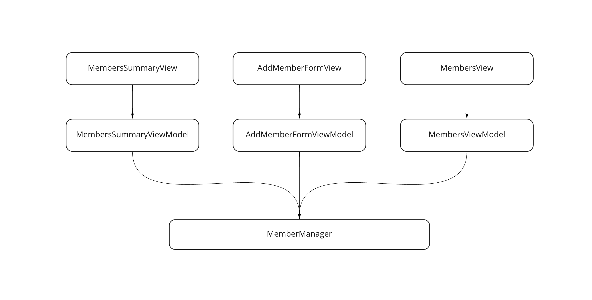

#  Combine with SwiftUI

This repo demonstrates a technique of using the Combine framework together with SwiftUI to allow for reactive patterns and cross-view data sharing in a testable manner.

The app manages a list of `Members`. The user can add and remove members. The UI features a summary view, which displays the total number of members; a new-member form, which the user can use to add new members; and a members view, which dispalys a list of all the members and allows the user to remove members from the list.

## Code design



Each SwiftUI view is backed by its own view model class. The view model classes each have a reference to the `MemberManager`, which is a protocol with singleton object implementation.

### `MemberManager`

`MemberManager` defines a protocol:

```swift
enum MemberFailure: Error {
    case invalidName
}

protocol MemberManager {
    var membersPublisher: AnyPublisher<Result<[Member], MemberFailure>, Never> { get }
    func addMember(name: String)
    func remove(member: Member)
}
```

The protocol declares a `membersPublisher` property of type `AnyPublisher`. It is the central source of data for the list of members. `membersPublisher` has two subscribers:

- the `MembersSummaryViewModel`, which maintains a count of the total number of members
- the `MembersViewModel`, which maintains a list of all members

The `DefaultMemberManager` class implements the `MemberManager` protocol. Some things to note:

- It is implemented as a singleton. Being a singleton is important, as it is the single source of truth for the `Member` array. As such, `init()` is declared to be private, to prevent other classes from inadvertently instantiating their own instances.
- It maintains a private `membersSubject`, which it exposes as a `Publisher` via the protocal. This ensures that while other classes can subscribe to the subject, only the `DefaultMemberManager` can publish to it.
- The `membersSubject` is a `CurrentValueSubject`, which means (1) that it always has a value (and therefore must be instantiated with an initial value), and (2) when a new subscriber subscribes to the subject, the subject will publish its latest value to the subscriber, even if the subscriber subscribes *after* the subject has already published that value to its other subcribers prior to the new subscriber's subscription. This ensure that all subscribers get the latest value, regardless of when they subscribe to the publisher.

```swift
class DefaultMemberManager: MemberManager {
    private static var sharedInstance: DefaultMemberManager?
    private var currentMembers: [Member] = []
    private var id = 0

    static var shared: DefaultMemberManager {
        if let sharedInstance = sharedInstance {
            return sharedInstance
        } else {
            sharedInstance = DefaultMemberManager()
            return sharedInstance!
        }
    }

    private init() {}

    private let membersSubject = CurrentValueSubject<Result<[Member], MemberFailure>, Never>(.success([]))

    var membersPublisher: AnyPublisher<Result<[Member], MemberFailure>, Never> {
        membersSubject.eraseToAnyPublisher()
    }

    func addMember(name: String) {
        if (name.lowercased() == "invalid name") {
            membersSubject.send(.failure(.invalidName))
        } else {
            id = id + 1
            let newMember = Member(id: id, name: name)
            currentMembers = currentMembers + [newMember]
            membersSubject.send(.success(currentMembers))
        }
    }

    func remove(member: Member) {
        guard let memberIndex = currentMembers.firstIndex(of: member) else { return }
        currentMembers.remove(at: memberIndex)
        membersSubject.send(.success(currentMembers))
    }
    
    func resetMembers() {
        membersSubject.send(.success([]))
    }
}
```

### The view models

The `MembersSummaryViewModel` and the `MembersViewModel` each contain a property marked with the `@Published` property wrapper. When the `membersPublisher` publishes a new array of `Members`, the view models update their published properites accordingly. For example:

```swift
class MembersSummaryViewModel: ObservableObject {
    private let memberManager: MemberManager
    private var subscription: AnyCancellable?

    @Published var memberCount: Int = 0

    init(memberManager: MemberManager) {
        self.memberManager = memberManager
        self.subscription = memberManager.membersPublisher
            .sink { [weak self] membersResult in
                if case let .success(members) = memberResult {
                    self?.memberCount = members.count
                }
            }
    }

    convenience init() {
        self.init(memberManager: DefaultMemberManager.shared)
    }

    deinit {
        subscription?.cancel()
    }
}
```

The view models' corresponding views leverage the published properties in the view model. For example:

```swift
struct MembersSummaryView: View {
    @ObservedObject private var viewModel: MembersSummaryViewModel

    init(viewModel: MembersSummaryViewModel) {
        self.viewModel = viewModel
    }

    init() {
        self.init(viewModel: MembersSummaryViewModel())
    }

    var body: some View {
        Text("Number of members: \(viewModel.memberCount)").bold()
    }
}
```

## Testing

### Testing the `Views` and their `ViewModels`

We test each `View` together with its `ViewModel`. Because `MemberManager` is a protocol, it is easy to create a test double for it:

```swift
class SpyMemberManager: MemberManager {
    let membersSubject = CurrentValueSubject<Result<[Member], MemberFailure>, Never>(.success([]))
    private var addMemberArgs: AddMemberArgs?
    private var removeArgs: RemoveArgs?

    var membersPublisher: AnyPublisher<[Member], Never> {
        membersSubject.eraseToAnyPublisher()
    }

    func addMember(name: String) {
        addMemberArgs = AddMemberArgs(name: name)
    }

    func remove(member: Member) {
        removeArgs = RemoveArgs(member: member)
    }

    func addMemberWasCalled(with name: String) -> Bool {
        return addMemberArgs?.name == name
    }

    func removeWasCalled(with member: Member) -> Bool {
        return removeArgs?.member == member
    }

    struct AddMemberArgs {
        let name: String
    }

    struct RemoveArgs {
        let member: Member
    }
}
```

Notice that here, the `membersSubject` is public, not private. This allows tests to publish to the subject in order to trigger the intended behavior in the object under test. For example:

```swift
class MembersSummaryViewTest: QuickSpec {
    override func spec() {
        var subject: MembersSummaryView!
        var memberManager: SpyMemberManager!

        beforeEach {
            memberManager = SpyMemberManager()

            let viewModel = MembersSummaryViewModel(memberManager: memberManager)
            subject = MembersSummaryView(viewModel: viewModel)
        }

        it("displays the number of members") {
            memberManager.membersSubject.send(.success([
                Member(id: 1, name: "one"),
                Member(id: 2, name: "two")
            ]))

            let view = try subject.inspect()

            expect(try view.find(text: "Number of members: 2")).notTo(beNil())
        }
    }
}
```

### Testing the `MemberManager`

As for testing the `DefaultMemberManager`, we want to verify that in response to various actions, it publishes the appropriate `Member` array. To do this, we can subscribe to the `membersPublisher` and store the published array in a variable that we can then assert against. For example:

```swift
class DefaultMemberManagerTest: QuickSpec {
    override func spec() {
        var subject: DefaultMemberManager!
        var actualMembers: [Member] = []
        var subscription: AnyCancellable!

        beforeEach {
            subject = DefaultMemberManager.shared

            subscription = subject.membersPublisher
                .sink { membersResult in
                    if case let .success(members) = membersResult {
                        actualMembers = members
                    }
                }                
        }

        afterEach {
            subject.resetMembers()
            subscription.cancel()
        }

        describe("adding and removing members") {
            it("publishes the updated members") {
                subject.addMember(name: "new member name")

                expect(actualMembers).to(equal([
                    Member(id: 1, name: "new member name")
                ]))

                subject.addMember(name: "second member name")

                expect(actualMembers).to(equal([
                    Member(id: 1, name: "new member name"),
                    Member(id: 2, name: "second member name")
                ]))

                subject.remove(member: Member(id: 1, name: "new member name"))

                expect(actualMembers).to(equal([
                    Member(id: 2, name: "second member name")
                ]))
                
                
                subject.addMember(name: "a third member")
                
                expect(actualMembers).to(equal([
                    Member(id: 2, name: "second member name"),
                    Member(id: 3, name: "a third member")
                ]))
            }
        }
        
        describe("handling an invalid member name") {
            beforeEach {
                subject.addMember(name: "invalid name")
            }
        
            it("publishes an 'invalid name' error") {
                expect(memberFailure).to(equal(.invalidName))
            }
        
            it("does not publish a new member") {
                expect(actualMembers).to(equal([]))
            }
        }
    }
}
```
